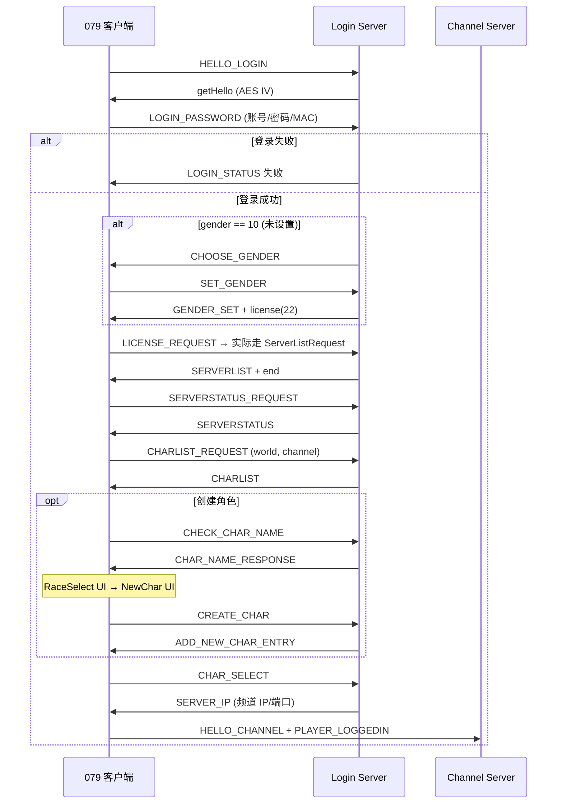
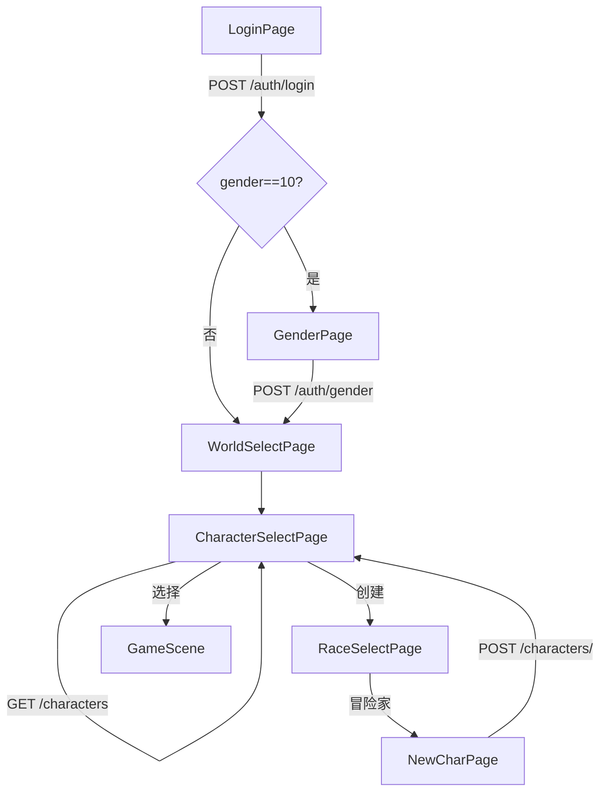

# ms079-main 登录→音乐→选角→创建 完整复刻手册

> **用途**：本文档记录本项目如何把 `../mapleStory079-external/02-★ms079-main-业务规则对照-登录创角禁名-WZ-XML`（079 Java 私服源码 + WZ XML）「照搬」到 **Go REST 后端 + Flutter Web 客户端** 的整条登录管线。  
> **读者**：你自己手搓时，按本文从源码定位 → 改服务端 → 改客户端 → 跑资源脚本 → 验证。

---

## 目录

1. [总览：原版 vs 本项目](#1-总览原版-vs-本项目)
2. [ms079-main 原版完整流程（TCP）](#2-ms079-main-原版完整流程tcp)
3. [本项目实现的流程（REST + Flutter）](#3-本项目实现的流程rest--flutter)
4. [WZ 资源对照表（Login.img / MapLogin2 / Sound）](#4-wz-资源对照表)
5. [客户端架构与文件地图](#5-客户端架构与文件地图)
6. [服务端架构与文件地图](#6-服务端架构与文件地图)
7. [角色创建规则（必须跟源码一致）](#7-角色创建规则必须跟源码一致)
8. [REST API 契约](#8-rest-api-契约)
9. [数据库字段说明](#9-数据库字段说明)
10. [资源管线：从 WZ 到 Flutter assets](#10-资源管线从-wz-到-flutter-assets)
11. [本地开发：启动与验证](#11-本地开发启动与验证)
12. [手搓指南：改一个功能的标准步骤](#12-手搓指南改一个功能的标准步骤)
13. [已知差距与 TODO 清单](#13-已知差距与-todo-清单)
14. [排错手册](#14-排错手册)

---

## 1. 总览：原版 vs 本项目

| 维度 | ms079-main（原版） | 本项目（mapleStory079） |
|------|-------------------|------------------------|
| 传输 | TCP 二进制 + AES + Opcode | HTTP JSON REST |
| 登录服/频道服 | 分离，选角后进频道 TCP | 单 Go 服务，选角后 REST 进游戏 |
| UI | 客户端读 WZ，MapLogin2 垂直卷轴 + Login.img 叠加 | Flutter `WzSceneScreen` + JSON manifest |
| BGM | 客户端读 `MapLogin2.img` → `BgmUI/Title` | 全登录页统一 `audio/title.mp3` |
| 性别 | 账号级，`SetGenderRequest` | `POST /auth/gender`，`accounts.gender` |
| 禁名 | `Etc.wz/ForbiddenName.img` 子串匹配 | `pkg/utils/forbidden_names.go` 读同 XML |
| 创建角色 | `CREATE_CHAR` 封包 + 白名单 | `POST /characters/` + 同白名单 |

**设计原则**：业务规则（数值、物品、白名单、禁名、JobType）**以 Java 源码为准**；传输层用 REST 简化，但**不要自己发明规则**。

---

## 2. ms079-main 原版完整流程（TCP）

### 2.1 关键源码文件

| 文件 | 作用 |
|------|------|
| `../mapleStory079-external/02-★ms079-main-业务规则对照-登录创角禁名-WZ-XML/src/main/java/handling/MapleServerHandler.java` | Opcode 分发（登录服） |
| `../mapleStory079-external/02-★ms079-main-业务规则对照-登录创角禁名-WZ-XML/src/main/java/handling/login/handler/CharLoginHandler.java` | 登录/性别/选角/创建/删除 |
| `../mapleStory079-external/02-★ms079-main-业务规则对照-登录创角禁名-WZ-XML/src/main/java/handling/login/LoginWorker.java` | 登录成功后分支（性别/服务器列表） |
| `../mapleStory079-external/02-★ms079-main-业务规则对照-登录创角禁名-WZ-XML/src/main/java/tools/packet/LoginPacket.java` | 发包结构 |
| `../mapleStory079-external/02-★ms079-main-业务规则对照-登录创角禁名-WZ-XML/src/main/java/client/MapleCharacter.java` | `getDefault()`、`saveNewCharToDB()` |
| `../mapleStory079-external/02-★ms079-main-业务规则对照-登录创角禁名-WZ-XML/src/main/java/handling/login/LoginInformationProvider.java` | 禁名 |
| `../mapleStory079-external/02-★ms079-main-业务规则对照-登录创角禁名-WZ-XML/src/main/java/client/MapleCharacterUtil.java` | 角色名规则 |
| `../mapleStory079-external/02-★ms079-main-业务规则对照-登录创角禁名-WZ-XML/wz/UI.wz/Login.img.xml` | 各屏 UI 节点尺寸 |
| `../mapleStory079-external/02-★ms079-main-业务规则对照-登录创角禁名-WZ-XML/wz/UI.wz/MapLogin2.img.xml` | 登录地图卷轴 + BGM |
| `../mapleStory079-external/02-★ms079-main-业务规则对照-登录创角禁名-WZ-XML/wz/Etc.wz/ForbiddenName.img.xml` | 禁名列表 |
| `../mapleStory079-external/02-★ms079-main-业务规则对照-登录创角禁名-WZ-XML/wz/Sound.wz/BgmUI.img.xml` | Title 等 BGM |
| `../mapleStory079-external/02-★ms079-main-业务规则对照-登录创角禁名-WZ-XML/src/main/resources/recvops.properties` | 客户端→服务端 Opcode |

### 2.2 原版时序（简化）



### 2.2.1 登录后性别分支（LoginWorker）

- DB `accounts.gender` 默认 **10** = 未设置（见 `db/ms079.sql`）
- `gender == 10` → 发 `CHOOSE_GENDER`
- 否则 → 直接 `getAuthSuccessRequest` + 服务器列表

### 2.3 CREATE_CHAR 封包字段（CharLoginHandler.java ~L211）

```
MapleAsciiString name
int JobType          // 0=骑士团 1=冒险家 2=战神
int face
int hair
int top
int bottom
int shoes
int weapon
// hairColor=0, skinColor=0 写死在服务端
// gender 来自账号 c.getGender()，不在封包里
```

### 2.4 JobType → 职业 / 出生地图（MapleCharacter.java）

| JobType | 含义 | job ID | map ID | 指南 item |
|---------|------|--------|--------|-----------|
| 0 | 骑士团 | 1000 | 130030000 | 4161047 |
| 1 | 冒险家 | 0 | **0** | 4161001 |
| 2 | 战神 | 2000 | 914000000 | 4161048 |

**所有 JobType** 额外获得 USE 栏：`2022336`（秘密箱子/新手礼包）

### 2.5 初始属性（MapleCharacter.getDefault ~L208）

```
level=1, str=12, dex=5, int=4, luk=4
hp=50, maxhp=50, mp=50, maxmp=50
remainingAp=0, meso=0, buddy=20
```

### 2.6 外观白名单（CharLoginHandler.java ~L240-318）

**男**  
- face: 20100, 20401, 20402  
- hair: 30030, 30027, 30000  
- top: 1040002, 1040006, 1040010, **1042167**  
- bottom: 1060002, 1060006, **1062115**  

**女**  
- face: 21002, 21700, 21201  
- hair: 31002, 31047, 31057  
- top: 1041002, 1041006, 1041010, 1041011, **1042167**  
- bottom: 1061002, 1061008, **1062115**  

**通用**  
- shoes: 1072001, 1072005, 1072037, 1072038, **1072383**  
- weapon: 1302000, 1322005, 1312004, **1442079**  

### 2.7 职业开放开关（ServerProperties / ServerConstants）

默认 ms079-main 配置通常是：

- `server.job.adventurer = true`
- `server.job.knights = false`
- `server.job.war-god = false`

对应 `CreateChar` 里对 JobType 0/2 直接 `return` 并提示未开放。

### 2.8 BGM 与音效

| 资源 | WZ 路径 | 何时播放 |
|------|---------|----------|
| 登录全流程 BGM | `Sound.wz/BgmUI.img` → **Title** | MapLogin2 所有屏（`MapLogin2.img.xml` 的 `bgm=BgmUI/Title`） |
| 选角 UI 音效 | `Sound.wz/UI.img` → CharSelect | 客户端交互 |
| 选世界 UI 音效 | UI.img → WorldSelect | 客户端交互 |
| 选种族 UI 音效 | UI.img → RaceSelect | 客户端交互 |

**注意**：原版**不是**选角换一首 BGM，而是全程 Title。

---

## 3. 本项目实现的流程（REST + Flutter）

### 3.1 页面路由（`client/lib/main.dart`）

| 路由 | 页面 | 对应 Login.img |
|------|------|----------------|
| `/login` | `LoginPage` | Title |
| `/gender` | `GenderPage` | Title/Gender |
| `/world-select` | `WorldSelectPage` | WorldSelect |
| `/character-select` | `CharacterSelectPage` | CharSelect |
| （Modal） | `RaceSelectPage` | RaceSelect |
| （Modal） | `NewCharPage` | NewChar |
| `/game-scene` | `GameSceneLoader` | 进游戏 |

### 3.2 导航逻辑

```
LoginPage._submit 成功
  └─ auth.needsGender (account.gender == 10)?
       ├─ 是 → /gender
       └─ 否 → /world-select

WorldSelectPage 点「进入」
  └─ /character-select

CharacterSelectPage 点「创建」
  └─ push RaceSelectPage
       └─ 选「冒险家」→ push NewCharPage(jobType=1)
       └─ pop(true) → 刷新角色列表

CharacterSelectPage 点「选择」
  └─ GameProvider.loadCharacterState → /game-scene
```

**测试账号** `test` 在 seed 里已设 `gender=0`，登录后**跳过性别页**直达选区。

### 3.3 客户端流程图



### 3.4 音乐实现

- 常量：`client/lib/core/resources/assets.dart` → `BgmAssets.login` = `audio/title.mp3`
- 所有 `assets/scenes/login_*.json` 的 `"bgm": "audio/title.mp3"`
- `WzSceneScreen` 在 `initState` 里 `AudioManager().playBgmAsset(manifest.bgm)`
- `AudioManager` 有 `_currentBgm` 去重，切页不重启同一首
- **进游戏时** `CharacterSelectPage._enterGame` 才 `stopBgm()`

### 3.5 UI 尺寸（Login.img/NewChar — 冒险家）

| 节点 | 宽×高 | 本项目布局（NewCharPage） |
|------|-------|---------------------------|
| charSet | 245×193 | left:38, top:198 |
| charName | 199×128 | left:553, top:118 |
| scroll | 245×193 | left:303, top:215 |
| avatarSel | 160×17 ×6 项 | scroll 内左侧 |
| BtYes/BtNo | 85×29 | bottom:38 |
| BtLeft/BtRight | 6×11（hover 更大） | 我们用 15×16 占位按钮 |
| dice | 37×26 | left:548, top:232 |

Knight/Aran 的 NewCharKnight/NewCharAran 尺寸不同（见 Login.img.xml ~L8375+），**尚未单独实现 UI**。

---

## 4. WZ 资源对照表

### 4.1 Login.img 屏幕节点

路径：`../mapleStory079-external/02-★ms079-main-业务规则对照-登录创角禁名-WZ-XML/wz/UI.wz/Login.img.xml`

| imgdir | 用途 |
|--------|------|
| `Title` | 登录标题、BtLogin、Gender/Backgrnd |
| `WorldSelect` | 选区 chBackgrn、频道确认 Popup |
| `CharSelect` | 选角 BtSelect/BtNew/BtDelete、pageL/pageR |
| `RaceSelect` | BtKnight/BtNormal/BtAran |
| `NewChar` | 冒险家创建 |
| `NewCharKnight` | 骑士团创建 |
| `NewCharAran` | 战神创建 |

### 4.2 MapLogin2 卷轴地图

路径：`../mapleStory079-external/02-★ms079-main-业务规则对照-登录创角禁名-WZ-XML/wz/UI.wz/MapLogin2.img.xml`

- 画布：**800×600**
- **bgm**: `BgmUI/Title`
- 各屏通过 obj 的 **Y 坐标**（负值很大）做垂直卷轴，例如 NewChar signboard 在 y≈-3600~-3800

本项目**没有**实现卷轴滚动，而是用**每屏独立 PNG + JSON manifest** 近似。

### 4.3 资源输出目录

```
client/assets/
├── audio/
│   ├── title.mp3          ← Sound/BgmUI.img/Title（需 WZ 提取）
│   └── title.wav          ← 无 mp3 时的回退
├── scenes/
│   ├── login_title.json + login_title.png
│   ├── login_gender.json + login_gender.png
│   ├── login_worldselect.json + login_worldselect.png
│   ├── login_charselect.json + login_charselect.png
│   ├── login_raceselect.json + login_raceselect.png
│   └── login_newchar.json + login_newchar.png
├── images/ui/login/
│   ├── btn_*.png          ← 按钮三态
│   ├── newchar_*.png      ← 创建 UI 面板
│   ├── logo_0/1.png
│   └── back/00..37.png    ← 登录背景层（可选）
└── characters/parts/
    └── {itemId}.png       ← Character stand1 精灵（需 WZ 提取）
```

---

## 5. 客户端架构与文件地图

### 5.1 核心模块

| 文件 | 职责 |
|------|------|
| `features/maple/wz_scene.dart` | 加载 JSON manifest、800×600 场景、BGM、按钮 hit-test |
| `features/maple/wz_widgets.dart` | `WzSpriteButton`、`WzPanelFrame`、`WzAvatarTab` |
| `features/maple/wz_asset_image.dart` | 多路径 fallback（procedural vs WZ `_normal` 命名） |
| `features/maple/maple_avatar_view.dart` | 角色预览：优先 parts PNG，否则方块 fallback |
| `features/maple/maple_ui.dart` | `MapleCharacterPreview` 方块人、`AudioManager` 引用 |
| `core/resources/login_ui_assets.dart` | Login.img 资源路径常量 |
| `core/resources/assets.dart` | BGM/SFX/GameConstants |
| `services/api_service.dart` | 所有 REST 调用 |
| `providers/auth_provider.dart` | 登录态、角色列表、setGender |
| `features/character/beginner_creation_catalog.dart` | 与 Java 白名单一致的 ID + JobType |

### 5.2 各页面职责

| 页面 | 场景 JSON | 主要交互 |
|------|-----------|----------|
| `login/login_page.dart` | login_title.json | 账号密码、注册切换 |
| `login/gender_page.dart` | login_gender.json | 男/女 → setGender |
| `login/world_select_page.dart` | login_worldselect.json | 频道单选 → 进选角 |
| `login/race_select_page.dart` | login_raceselect.json | 三职业族，仅冒险家可用 |
| `character/character_select_page.dart` | login_charselect.json | 6 槽分页、选/创/删 |
| `character/new_char_page.dart` | login_newchar.json | 6 tab 外观、骰子、创建 |

### 5.3 WzSceneManifest JSON 格式

```json
{
  "width": 800,
  "height": 600,
  "bgm": "audio/title.mp3",
  "background": "scenes/login_charselect.png",
  "logo": { "path": "...", "x": 200, "y": 55, "w": 397, "h": 219, "frames": [], "fade_ms": 8000 },
  "slots": [{ "x": 155, "y": 220, "w": 120, "h": 180 }],
  "buttons": [{ "id": "select", "label": "选择", "rect": {...}, "normal": "...", "hover": "...", "pressed": "..." }],
  "login_panel": { "x": 268, "y": 320, "w": 263, "h": 179 }
}
```

**手搓新按钮**：在 JSON 加 `buttons[]`，在页面 `onButton` 回调里处理 `id`。

### 5.4 角色预览

选角槽位 `CharacterSelectPage._slotOverlays` 使用：

```dart
MapleAvatarView(
  gender: c.gender,
  face: c.face,
  hair: c.hair,
  top: c.top,      // 来自 API
  bottom: c.bottom,
  shoes: c.shoes,
  weapon: c.weapon,
)
```

API 必须在角色列表里返回装备 ID（见下文服务端）。

---

## 6. 服务端架构与文件地图

### 6.1 关键文件

| 文件 | 职责 |
|------|------|
| `internal/handler/routes.go` | 路由注册 |
| `internal/handler/auth_handler.go` | login/register/gender |
| `internal/handler/character_handler.go` | CRUD + check-name |
| `internal/handler/world_handler.go` | GET /worlds（简化服务器列表） |
| `internal/service/auth_service.go` | 账号逻辑、SetGender |
| `internal/service/character_service.go` | 创建规则、禁名、初始物品 |
| `pkg/utils/beginner_look.go` | 外观白名单校验 |
| `pkg/utils/forbidden_names.go` | 读 ForbiddenName.img.xml |
| `pkg/utils/constants.go` | JobType、MapTutorialStart=0、MP=50 |
| `pkg/database/models.go` | Account.gender、Character |
| `pkg/database/seed_079_accounts.go` | test 演示账号 |
| `cmd/server/main.go` | Init + AutoMigrate + InitForbiddenNames |

### 6.2 创建角色核心逻辑（character_service.go）

```
CreateCharacter(accountID, name, jobType, gender, look)
  ├─ CanCreateCharacterName (含禁名)
  ├─ validateJobTypeEnabled (仅冒险家开放)
  ├─ ValidateBeginnerLook (hairColor=0, skin=0)
  ├─ jobTypeToSpawn → class + mapID
  ├─ JobInitialStatsMap[JobBeginner] → HP/MP/STR...
  ├─ seedBeginnerEquipment (top/bottom/shoes/weapon 装备栏)
  └─ seedBeginnerInventory (指南 + 2022336)
```

**gender 来源**：handler 从 `accounts` 表读取，**忽略**客户端传的 gender（与 Java 一致）。

---

## 7. 角色创建规则（必须跟源码一致）

### 7.1 服务端常量（`pkg/utils/constants.go`）

```go
JobTypeKnight     = 0
JobTypeAdventurer = 1
JobTypeAran       = 2
AccountGenderUnset = 10
MapTutorialStart = 0        // 冒险家出生图
MapKnightStart   = 130030000
MapAranStart     = 914000000
JobBeginner       = 0
JobKnightBeginner = 1000
JobAranBeginner   = 2000
```

### 7.2 初始 MP

`JobInitialStatsMap[JobBeginner]` → **MP: 50**（不是 5）

### 7.3 客户端 catalog（`beginner_creation_catalog.dart`）

必须与 `CharLoginHandler.java` 白名单 **完全一致**。改 Java 白名单时，**同时改**：

- `client/.../beginner_creation_catalog.dart`
- `pkg/utils/beginner_look.go`
- `scripts/extract_beginner_parts/main.go` 里的 partIDs（若提取精灵）

### 7.4 avatarSel 6 项

| tab | 含义 | ms079 |
|-----|------|-------|
| 0 | 脸型 | ✓ |
| 1 | 发型 | ✓ |
| 2 | 上衣 | ✓ |
| 3 | 裤子 | ✓ |
| 4 | 鞋子 | ✓ |
| 5 | 武器 | ✓ |

**没有**肤色/发色 tab（服务端写死 0）。

---

## 8. REST API 契约

Base URL: `http://localhost:8080/api/v1`

### 8.1 认证

**POST /auth/login**

```json
// Request
{ "username": "test", "password": "test123456" }

// Response (envelope)
{
  "code": 0,
  "data": {
    "account": { "id": 1, "username": "test", "gender": 0, "status": 1 },
    "token": "...",
    "session_id": "sess_...",
    "expires_in": 86400
  }
}
```

**POST /auth/register**

```json
{ "username": "...", "password": "...", "email": "..." }
```

**POST /auth/gender**（对应 SetGenderRequest）

```json
{ "accountId": 1, "gender": 0 }
// gender: 0=男 1=女
```

### 8.2 世界列表

**GET /worlds**

```json
{
  "success": true,
  "data": [{
    "id": 0,
    "name": "蓝蜗牛",
    "channels": [
      { "id": 1, "name": "频道1", "load": 0 }
    ]
  }]
}
```

### 8.3 角色

**GET /characters/?accountId=1**

```json
{
  "success": true,
  "data": [{
    "id": 1,
    "name": "冒险者一号",
    "class": 0,
    "gender": 0,
    "face": 20100,
    "hair": 30000,
    "level": 1,
    "map_id": 0,
    "top": 1040002,
    "bottom": 1060002,
    "shoes": 1072001,
    "weapon": 1302000
  }]
}
```

**GET /characters/check-name?name=测试**

```json
{ "success": true, "available": true, "message": "" }
```

**POST /characters/**

```json
{
  "accountId": 1,
  "name": "我的角色",
  "jobType": 1,
  "face": 20100,
  "hair": 30000,
  "hairColor": 0,
  "skin": 0,
  "top": 1040002,
  "bottom": 1060002,
  "shoes": 1072001,
  "weapon": 1302000
}
```

**DELETE /characters/:id**

### 8.4 健康检查

**GET /health** — 看 DB counts、`data_ready`、demo_account

### 8.5 客户端解析注意

- 登录响应：`code=0` + `data.account`（见 `api_service.dart` `_unwrapData`）
- 角色响应：`success=true` + `data`
- 创建角色 URL **必须带尾斜杠** `/characters/`（否则 307）

---

## 9. 数据库字段说明

### 9.1 accounts

| 字段 | 含义 |
|------|------|
| gender | **10**=未设置，**0**=男，**1**=女 |
| status | 1=正常 |

### 9.2 characters

| 字段 | ms079 对应 |
|------|-----------|
| class | job（0/1000/2000） |
| map_id | 冒险家创建为 **0** |
| hp/max_hp/mp/max_mp | 50/50/50/50 |
| str/dex/int/luk | 12/5/4/4 |

### 9.3 character_inventory

创建时插入：

| slot | item | equipped |
|------|------|----------|
| coat | top | true |
| pants | bottom | true |
| shoes | shoes | true |
| weapon | weapon | true |
| ETC 100 | 4161001（冒险家） | false |
| USE 1 | 2022336 | false |

---

## 10. 资源管线：从 WZ 到 Flutter assets

### 10.1 一键脚本（推荐）

```bash
export MAPLE_WZ_ROOT=/path/to/MapleStory   # 含 Base.wz 的 079 客户端根目录
./scripts/setup_maple_wz.sh
```

内部顺序：

1. `go run scripts/extract_wz_login/main.go` — UI 按钮、Login/NewChar 面板、Title BGM
2. `go run scripts/extract_beginner_parts/main.go` — Character stand1 精灵
3. `go run scripts/build_login_scene/main.go` — 合成 6 个场景 PNG + JSON

### 10.2 无 WZ 客户端时

`build_login_scene` 会生成**程序化占位 PNG**（木纹理、羊皮卷），能跑通流程但**不是原版像素**。

### 10.3 extract_wz_login 关键 WZ 路径

| 输出 | WZ 路径 |
|------|---------|
| btn_login_normal.png | `/UI/Login.img/Title/BtLogin/normal/0` |
| newchar_charset.png | `/UI/Login.img/NewChar/charSet` |
| title.mp3 | `/Sound/BgmUI.img/Title` |
| logo_0.png | `/Map/Obj/login.img/Title/logo/0` |

完整列表见 `scripts/extract_wz_login/main.go` 的 `jobs` 数组。

### 10.4 按钮命名兼容

- 程序化生成：`btn_yes.png`
- WZ 提取：`btn_yes_normal.png`

`WzAssetImage` / `LoginUiAssets.resolve()` 会自动 fallback。

### 10.5 pubspec 资产声明

`client/pubspec.yaml`：

```yaml
flutter:
  assets:
    - assets/images/ui/login/
    - assets/scenes/
    - assets/audio/
    - assets/characters/parts/
```

新增目录后必须改 pubspec 并 `flutter pub get`。

---

## 11. 本地开发：启动与验证

### 11.1 初始化数据库

```bash
# MySQL 先建库
mysql -e "CREATE DATABASE IF NOT EXISTS maplestory CHARACTER SET utf8mb4;"

# 灌数据（--reset 清空重来）
go run scripts/init_data.go --reset
go run scripts/init_data.go --verify
```

### 11.2 启动后端

```bash
go run cmd/server/main.go
# 日志应出现: Forbidden names loaded from ms079-main
# http://localhost:8080/health
```

### 11.3 启动客户端

```bash
cd client
flutter pub get
flutter run -d web-server --web-hostname=localhost --web-port=5173
# 浏览器 http://localhost:5173
```

### 11.4 快速 API 测试

```bash
# 登录
curl -s -X POST http://localhost:8080/api/v1/auth/login \
  -H 'Content-Type: application/json' \
  -d '{"username":"test","password":"test123456"}'

# 角色列表
curl -s 'http://localhost:8080/api/v1/characters/?accountId=1'

# 禁名（"测试" 在 ForbiddenName 里）
curl -s 'http://localhost:8080/api/v1/characters/check-name?name=测试'
```

### 11.5 演示账号

| 用户名 | 密码 | 说明 |
|--------|------|------|
| test | test123456 | gender=0，跳过性别页 |

---

## 12. 手搓指南：改一个功能的标准步骤

### 12.1 例：增加一个新发型

1. **查 Java 白名单**  
   `CharLoginHandler.java` CreateChar 里 male/female hair 判断

2. **改 Go**  
   `pkg/utils/beginner_look.go` → `maleHairs` / `femaleHairs`

3. **改 Dart**  
   `beginner_creation_catalog.dart` → 同上数组

4. **（可选）提取精灵**  
   `scripts/extract_beginner_parts/main.go` partIDs 加新 ID  
   重新跑 `setup_maple_wz.sh`

5. **验证**  
   - 服务端：`ValidateBeginnerLook` 应通过  
   - 客户端：NewChar tab「发型」能切到新 ID  
   - POST create 成功

### 12.2 例：开放骑士团

1. Java：`ServerConstants.properties` → `server.job.knights=true`  
2. Go：`character_service.go` → `validateJobTypeEnabled` 对 JobTypeKnight return nil  
3. Dart：`race_select_page.dart` → 骑士团按钮 `enabled: true`  
4. 实现 `NewCharKnight` 布局（Login.img.xml 尺寸不同）  
5. map 130030000、job 1000、指南 4161047、骑士任务 seed

### 12.3 例：换选角页按钮位置

1. 查 `Login.img.xml` → `CharSelect/BtSelect` canvas 尺寸  
2. 查 `MapLogin2.img.xml` → CharSelect signboard 的 x,y  
3. 改 `scripts/build_login_scene/main.go` 里按钮 rect 或 JSON 手写  
4. `go run scripts/build_login_scene/main.go`  
5. 改 `login_charselect.json` 的 `buttons[].rect`  
6. Hot restart Flutter

### 12.4 例：真·原版 UI

1. 准备 079 客户端目录  
2. `MAPLE_WZ_ROOT=... ./scripts/setup_maple_wz.sh`  
3. 确认 `client/assets/images/ui/login/` 下 PNG 体积明显变大（非几 KB 占位图）  
4. 确认 `client/assets/audio/title.mp3` 存在  
5. 重启 Flutter

---

## 13. 已知差距与 TODO 清单

### 13.1 未实现的原版功能

| 功能 | Java 位置 | 说明 |
|------|-----------|------|
| TCP 登录协议 | MapleServerHandler | 整体用 REST 替代 |
| MAC 记录/封禁 | CharLoginHandler.login | 未做 |
| 二次密码 | DeleteChar / CharSelect | 删除用 AlertDialog |
| LICENSE_REQUEST 独立处理 | CharLoginHandler.LicenseRequest | Java 里也是死代码，实际走 ServerList |
| MapLogin2 垂直卷轴 | 客户端 | 用静态 PNG 代替 |
| NewCharKnight / NewCharAran UI | Login.img | 仅 RaceSelect 占位，职业未开放 |
| 骑士创建任务 seed | CreateChar case 0 | 20022 等 quest 未写入 |
| JWT 强制鉴权 | routes.go | token 发了但 /characters 未强制校验 |
| 频道服 handoff | SERVER_IP 封包 | 直接 REST 进 game-scene |
| UI.img 点击音效 | Sound/UI.img | 部分 SFX 资源缺失 |

### 13.2 资源层差距

- 无 WZ 客户端 → 方块人 + 程序化 UI  
- 有 WZ 客户端 → 需跑 extract 脚本才有像素级 UI 和 stand1 精灵

### 13.3 建议优先级（手搓顺序）

1. **P0** 有 WZ 则跑 `setup_maple_wz.sh`（视觉质变）  
2. **P1** JWT 绑定 accountId，防止伪造创建  
3. **P1** NewCharKnight UI + 开放骑士团（若需要）  
4. **P2** 二次密码删除流程  
5. **P2** UI.img 音效补齐（CharSelect/WorldSelect/RaceSelect/BtMouseClick）  
6. **P3** 真 TCP 登录服（若要对齐私服抓包）

---

## 14. 排错手册

| 现象 | 可能原因 | 处理 |
|------|----------|------|
| 登录后 accountId=0 | 未解析 `data.account.id` | 查 `api_service.parseLoginAccount` |
| 创建 307 失败 | POST 缺尾斜杠 | 用 `/characters/` |
| 按钮是丑色块 | PNG 路径错或未生成 | 查 `btn_yes.png` vs `btn_yes_normal.png`；跑 build_login_scene |
| 创建报「请先设置性别」 | account.gender=10 | 走 GenderPage 或 DB 改 gender |
| 创建报「骑士团未开放」 | jobType=0 | 选冒险家 jobType=1 |
| 禁名「测试」不可用 | 正常，ForbiddenName 含「测试」 | 换名 |
| 无 BGM | 缺 title.mp3/wav | WZ 提取或放 wav 到 assets/audio |
| 角色预览方块 | 无 parts PNG | 跑 extract_beginner_parts |
| DB 空 | 未 init | `go run scripts/init_data.go --reset` |
| MySQL 连不上 | config.yaml | host/user/password/database |

---

## 附录 A：Opcode 速查（仅供对照 Java）

见 `../mapleStory079-external/02-★ms079-main-业务规则对照-登录创角禁名-WZ-XML/src/main/resources/recvops.properties`：

| Hex | 名称 | Handler |
|-----|------|---------|
| 0x01 | LOGIN_PASSWORD | CharLoginHandler.login |
| 0x02 | SERVERLIST_REQUEST | ServerListRequest |
| 0x03 | LICENSE_REQUEST | → ServerListRequest |
| 0x04 | SET_GENDER | SetGenderRequest |
| 0x09 | CHARLIST_REQUEST | CharlistRequest |
| 0x0A | CHAR_SELECT | Character_WithoutSecondPassword |
| 0x0C | CHECK_CHAR_NAME | CheckCharName |
| 0x11 | CREATE_CHAR | CreateChar |
| 0x12 | DELETE_CHAR | DeleteChar |

---

## 附录 B：文件变更清单（本次重构涉及）

### 服务端

- `pkg/utils/forbidden_names.go`（新）
- `pkg/utils/beginner_look.go`
- `pkg/utils/constants.go`
- `pkg/database/models.go`
- `pkg/database/seed_079_accounts.go`
- `internal/service/character_service.go`
- `internal/service/auth_service.go`
- `internal/handler/character_handler.go`
- `internal/handler/auth_handler.go`
- `internal/handler/routes.go`
- `cmd/server/main.go`

### 客户端

- `lib/features/login/*.dart`（gender/world/race）
- `lib/features/character/new_char_page.dart`
- `lib/features/character/character_select_page.dart`
- `lib/features/character/beginner_creation_catalog.dart`
- `lib/features/maple/wz_*.dart`、`maple_avatar_view.dart`
- `lib/core/resources/assets.dart`、`login_ui_assets.dart`
- `lib/models/account.dart`、`character.dart`
- `lib/services/api_service.dart`
- `lib/providers/auth_provider.dart`
- `lib/main.dart`

### 脚本与资源

- `scripts/build_login_scene/main.go`
- `scripts/extract_wz_login/main.go`
- `scripts/extract_beginner_parts/main.go`
- `scripts/setup_maple_wz.sh`
- `client/assets/scenes/login_*.json`（6 个）

---

## 附录 C：推荐阅读顺序（读 ms079 源码）

1. `MapLogin2.img.xml` — 理解 BGM 和卷轴结构  
2. `Login.img.xml` — 找各屏 widget 尺寸  
3. `CharLoginHandler.java` — CreateChar 白名单 + 物品  
4. `MapleCharacter.getDefault` + `saveNewCharToDB` — 数值和 map  
5. `ForbiddenName.img.xml` — 禁名  
6. 本项目 `character_service.go` + `new_char_page.dart` — 看 REST/Flutter 如何映射  

---

*文档版本：与仓库当前实现同步（登录→音乐→选角→创建管线）。修改代码后请同步更新本文「API / 规则 / TODO」章节。*
